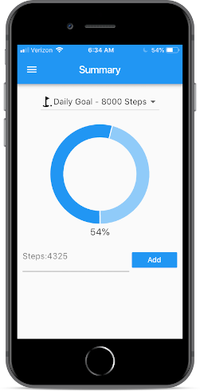
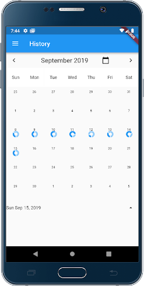
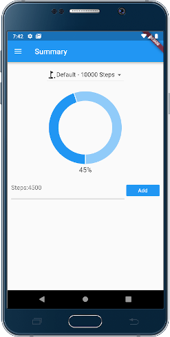

# CS551-ActivityTracker
A Flutter implementation of the CS551-ActivityTracker Assignment by Paul Bryden.
  
## Introduction  
This repository contains an open source Flutter implementation of a Step Counter application.  
The application was developed to be truly cross-platform and it is compatible with both iOS and Android devices.  
The user interface is Material design compliant and the design can be easily extended to integrate with fitness hardware.
  
## Screenshots  

  